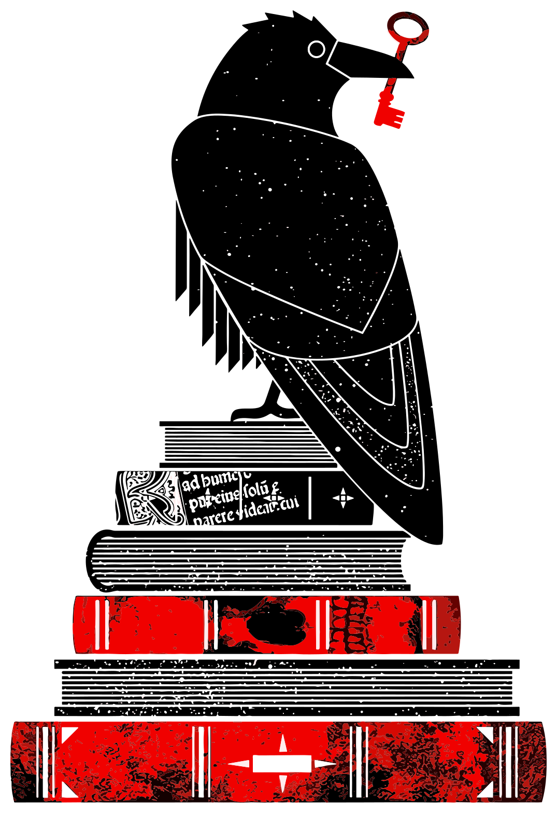
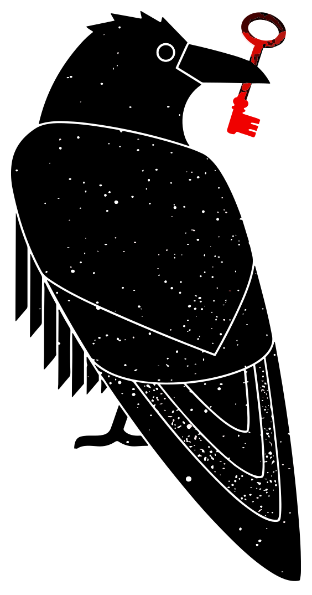

# Sci-Hub Sticker
I wanted to order a bunch of [Sci-Hub](https://sci-hub.se/) logo stickers. But then I found out that the raven was an appropriated [illustration from 2011 by Kate McLelland](https://web.archive.org/web/20200622215842/https://gossipwolf.blogspot.com/2011/11/final-postcards-revealed.html) ([thank you Wikipedia](https://en.wikipedia.org/wiki/File:Scihub_raven.png)) and that all the stickers are low-quality copies of McLelland's wonderful work. The original can only be accessed via Wayback machine.

To make a shitty thing half-right, I upscaled, vectorized and prepared the raven to be printed as a sticker. You can download an archive with the original, vectorized as SVG, and two PNGs with the raven on the book, and without books.

Thank you, Kate McLelland for this wonderful raven 💖 🐦‍⬛[^1]

## License
This sticker set is released under [CC0 1.0](LICENSE).

[^1]: The emoji shows a blackbird, not a raven… I know my birds!
