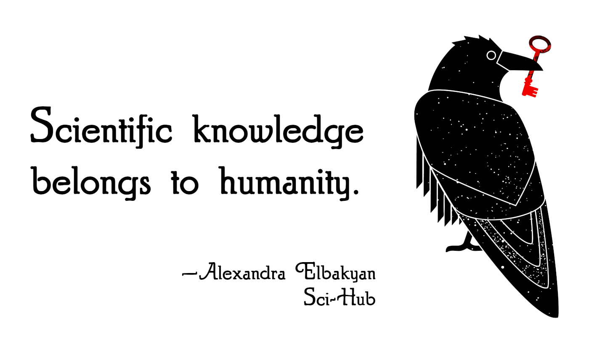
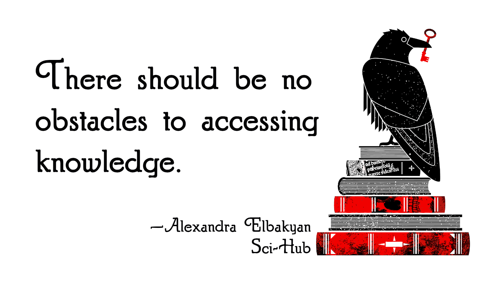
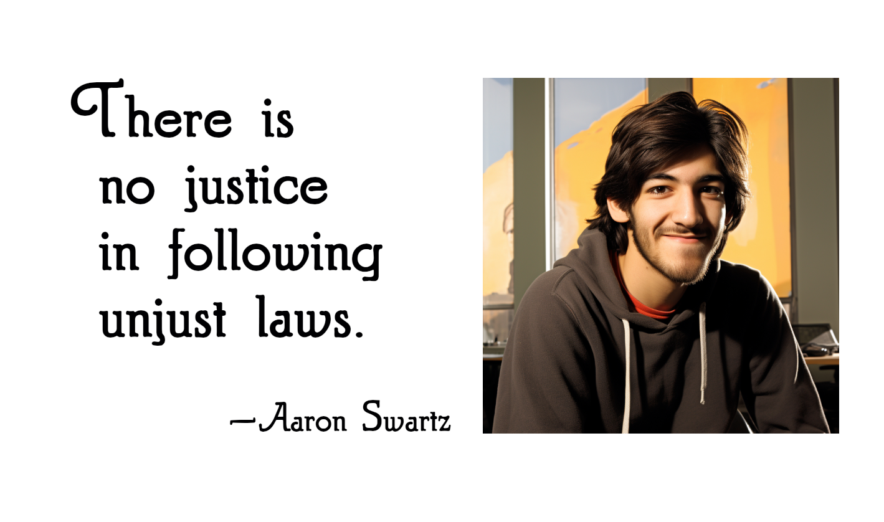

# Sci-Hub Sticker
## Background
I wanted to order a bunch of [Sci-Hub](https://sci-hub.se/) logo stickers. But then I found out that the raven was an appropriated [illustration from 2011 by Kate McLelland](https://web.archive.org/web/20200622215842/https://gossipwolf.blogspot.com/2011/11/final-postcards-revealed.html) ([thank you Wikipedia](https://en.wikipedia.org/wiki/File:Scihub_raven.png)) and that all the stickers are low-quality copies of McLelland's wonderful work. The original can only be accessed via Wayback machine.

To make a shitty thing half-right, I upscaled, vectorized and prepared the raven to be printed as a sticker. You can download an archive with the original, vectorized as SVG, and two PNGs with the raven on the book, and without books.

Thank you, Kate McLelland for this wonderful raven 💖

## *Omnious Raven* Stickers

## ✨ Sci-Hub and Aaron Swartz Sticker Sheets ✨
[Nissa Tolton](https://mastodon.social/@tolton) was so kind and amazing to use the *Omnious Raven* vector files to create a Sci-Hub sticker sheet with quotes from [Alexandra Elbakyan](https://sci-hub.se/alexandra)! Nissa also provided a sticker sheet with quotes from [Aaron Swartz](https://en.wikipedia.org/wiki/Aaron_Swartz), which fits just right into this repository. Thank you Nissa 💖 

 
 

- [Sci-Hub Sticker Sheet](sticker-sheets/hama_50450-scihub.pdf)
- [Aaron Swartz Sticker Sheet](sticker-sheets/hama_50450-swartz.pdf)

The sheets are prepared for the [Avery Zweckform 70x37mm sheets](https://www.avery-zweckform.com/blanko-etiketten/rechteckig-70x37-mm). You could adjust the `.tex` files and adjust the sheets for other formats.

## Authorship
This repository's content is released under [CC0 1.0](LICENSE). The *Omnious Raven* was originally drawn by [Kate McLelland](https://katemclelland.com/) and later refurbished by [@thgie](https://post.lurk.org/@thgie), the Sci-Hub and Aaron Swartz sticker sheets were created by [@tolton](https://mastodon.social/@tolton), and the Aaron Swartz illustration was generated through Midjourney.
